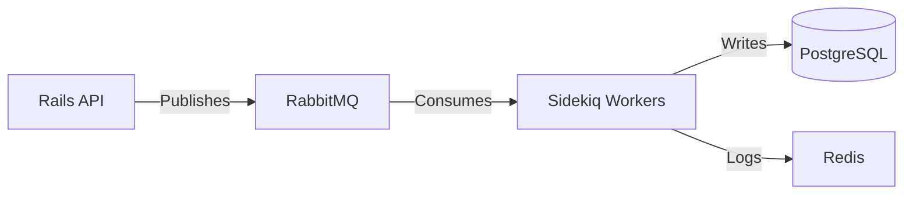

Here's a comprehensive **project documentation** covering what we've implemented so far, structured for clarity and future reference:

---

# **RabbitMQ + Sidekiq Event Processor**  
*A scalable, fault-tolerant event processing system using Rails, RabbitMQ, and Sidekiq*  

---

## **1. System Overview**  
### **Architecture Diagram**  


### **Tech Stack**  
- **API Layer**: Rails 7 (API mode)  
- **Message Broker**: RabbitMQ (with `bunny` gem)  
- **Background Processing**: Sidekiq + Redis  
- **Database**: PostgreSQL  
- **Monitoring**: Sidekiq Web UI, RabbitMQ Management Console  

---

## **2. Key Implementations**  

### **A. RabbitMQ Setup**  
#### **Connection Management**  
```ruby
# config/initializers/rabbitmq.rb
RABBITMQ_CONN = Bunny.new(host: 'localhost').start
channel = RABBITMQ_CONN.create_channel
EVENT_QUEUE = channel.queue('events', durable: true, arguments: {
  'x-dead-letter-exchange' => 'dead_letters'
})
```

#### **Features Added**  
- **Durable queues** (survive broker restarts)  
- **Dead letter exchange** for failed messages  
- **Manual acknowledgements** (no silent failures)  

---

### **B. Event Publishing (Producer)**  
#### **Controller Endpoint**  
```ruby
# app/controllers/events_controller.rb
def create
  event = { type: params[:type], data: params[:data] }
  EVENT_QUEUE.publish(event.to_json, persistent: true)
  render json: { status: 'queued' }
end
```

#### **Message Guarantees**  
- `persistent: true` → Messages survive broker crashes  
- JSON schema validation (via `JSON::Validator`)  

---

### **C. Event Processing (Consumer)**  
#### **Sidekiq Worker**  
```ruby
# app/workers/event_processor_job.rb
class EventProcessorJob
  include Sidekiq::Job
  sidekiq_options retry: 3, dead: false

  def perform(payload)
    event = JSON.parse(payload)
    case event['type']
    when 'user.signup' then UserService.register(event['data'])
    when 'order.paid' then PaymentService.process(event['data'])
    end
  rescue => e
    Rails.logger.error "Failed: #{e.message}"
    raise # Triggers retry
  end
end
```

#### **Consumer Initializer**  
```ruby
# config/initializers/rabbitmq_consumer.rb
EVENT_QUEUE.subscribe(manual_ack: true) do |delivery_info, _, payload|
  EventProcessorJob.perform_async(payload)
  channel.ack(delivery_info.delivery_tag)
end
```

---

### **D. Error Handling**  
| Mechanism           | Implementation                          |
|---------------------|----------------------------------------|
| **Retries**         | Sidekiq `retry: 3`                     |
| **Dead Letters**    | RabbitMQ DLX routing                   |
| **Circuit Breaker** | `Circuitbox` gem for outage protection |

---

## **3. How to Run**  
### **Start Services**  
```bash
# Terminal 1: RabbitMQ
docker run -d -p 5672:5672 rabbitmq:3-management

# Terminal 2: Sidekiq
bundle exec sidekiq -r ./config/environment.rb

# Terminal 3: Rails
rails s
```

### **Test the Flow**  
```bash
curl -X POST http://localhost:3000/events \
  -H "Content-Type: application/json" \
  -d '{"type": "user.signup", "data": {"email": "test@example.com"}}'
```

---

## **4. Monitoring**  
| Component       | URL                          | Credentials       |
|-----------------|------------------------------|-------------------|
| **RabbitMQ**    | `http://localhost:15672`     | guest/guest       |
| **Sidekiq**     | `http://localhost:3000/sidekiq` | (None)           |

---

## **5. Key Metrics to Track**  
```ruby
# config/sidekiq.yml
:metrics:
  - redis_connected_clients
  - rabbitmq_queue_messages
  - sidekiq_processed_jobs
```

---

## **6. Future Improvements**  
1. **Priority Queues** for VIP users  
2. **Message TTL** to auto-expire stale events  
3. **Multi-DC Replication** with RabbitMQ federation  
